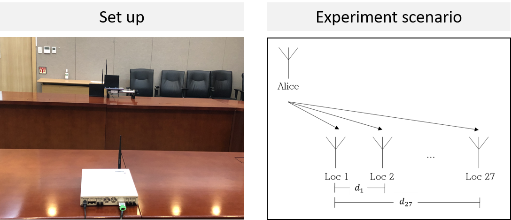
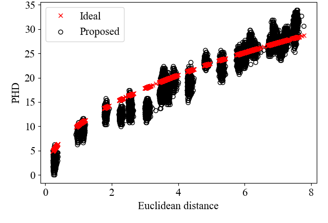

Deep Learning based end-to-end Physical Layer Secret Key Generation using Wireless Channel State Information
=======================================

This repository is the official implementation of Deep Learning based end-to-end Physical Layer Secret Key Generation using Wireless Channel State Information.  
You can find the paper here:
[link](https://www.dbpia.co.kr/pdf/pdfView.do?nodeId=NODE10501198&mark=0&useDate=&bookmarkCnt=0&ipRange=N&accessgl=Y&language=ko_KR)

### __Context__
* [Introduction](#introduction)
* [Methodology](#methodology)
* [Experiment and Datasets](#experiment-and-datasets)
* [Usuage](#usuage)
* [Results](#results)

Introduction
=======================================
### The Necessity of Wireless Communication Security Research Using Physical Layer Information
* By 2030, 500 billion wireless devices will be connected
* Wireless communication is vulnerable to potential attacks from eavesdroppers and requires additional security
* Cryptographic-based key generation is inappropriate for low-cost wireless communications devices due to high computational complexity
* Simplified wireless communication security research using physical layer information (CSI) is required
### Need to generate end-to-end keys
* The process of key generation using CSI is typically divided into four stages: channel probing, quantization, information reclamation, and privacy amplification
* Quantization is the process of converting channel measurements into binary values, which results in loss of information
* Additional communication between users is required to restore lost information
* Requires end-to-end key generation for additional communication-free key generation

Methodology
=======================================

* Converting the gain of these two into binary keys through deep learning models when legitimate users Bob and unjust user Eve are present
* Initially, deep learning has random weights
Based on an early basis, the purpose function determines the suitability of the key
* Updates the weight of deep learning by optimizing the objective function through genetic algorithms
* when optimization is over, we use the best deep learning model
* The objective function to be optimized is as follows

* The resulting characteristics of the generated keys are as follows:

|Correlated|Nonlinearity|  
|:------------:|:------------:|
|Distance between CSI and key is correlated|Distance between CSI and key is a nonlinear relationship|

Experiment and Datasets
==================
### Experiment

* IEEE 802.11 framework
* 5GHz carrier frequency (60 mm wavelength)
* 80 MHz bandwidth (242 valid subcarriers)
* Fix the position of the Alice and place it linearly at 6 mm intervals from Loc 1 to Loc 27.

### Dataset

* Use gain of the channel state information

Usage
==================
### Requirements 
To install requirements:
```setup
pip install -r requirements.txt
```
### Training and Evaluation
There is two options to training model and evaluate the result.
```train and eval
python main.py --result_save_dir <path-to-dir> --EPOCHS 1000 --N_POPULATION 100 --N_BEST 10 --h1 64 --h2 64 --h3 64 --early_stopping 50 --POWER_RATIO 0.5 --CONST 0.8
python evaluate.py --result_save_dir <path-to-dir> --reference 1 --POWER_RATIO 0.5 --CONST 0.8
```

or just
```train
sh run.sh
```
### Pre-trained models
You can use the pre-trained model without re-training from the beginning.  
It can be found in 'results' dir and just specify the result_save_dir in evaluate.py argument to it.
```eval with pre-trained model
python evaluate.py --result_save_dir results --reference 1 --POWER_RATIO 0.5 --CONST 0.8
```

Results
==================

* Suppose Loc 1 as Bob, Loc 2-27 as Eve
* Assign alpha as 0.8 in objective function


* Metric: Percential Hamming Distance (PHD)


* PHD increases nonlinearly as distance moves away

Contact
==================
If there is something wrong or you have any questions, send me an e-mail or make an issue.  
[](mailto:pond9816@gmail.com)
